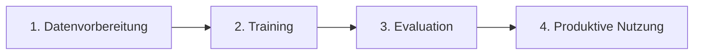

# Chatterbox-CleanUNet

Ein vollständiges CleanUNet-basiertes System zur selektiven Entfernung von TTS-Artefakten aus Audiodateien. Das System ist darauf spezialisiert, wiederkehrende Säusel- und Sirrgeräusche in Voice-Cloning-generierten Audiodateien zu behandeln.

## 🚀 Features

- **State-of-the-Art CleanUNet Architektur** mit Self-Attention
- **Chunk-basierte Verarbeitung** für lange Audiodateien
- **Batch-Verarbeitung** für effiziente Massenbearbeitung
- **RTX 4080 optimiert** (16GB VRAM)
- **Vollständige CLI-Integration**
- **Umfassende Evaluation-Metriken** (PESQ, STOI, SNR, etc.)
- **Mixed Precision Training** für optimale Performance
- **Reproduzierbare Ergebnisse**

## 📋 Inhaltsverzeichnis

- [Installation](#installation)
- [Schnellstart](#schnellstart)
- [Training](#training)
- [Inferenz](#inferenz)
- [Konfiguration](#konfiguration)
- [Daten-Vorbereitung](#daten-vorbereitung)
- [Evaluation](#evaluation)
- [API-Referenz](#api-referenz)
- [Troubleshooting](#troubleshooting)
- [Contributing](#contributing)

## 🛠️ Installation

### Systemanforderungen

- Python 3.8+
- CUDA 11.0+ (optional, für GPU-Beschleunigung)
- 16GB RAM (minimal), 32GB empfohlen
- 16GB VRAM (für Training auf RTX 4080)

### 1. Repository klonen

```bash
git clone <repository-url>
cd TTS-Pipeline-enhanced/Chatterbox-CleanUNet
```

### 2. Abhängigkeiten installieren

```bash
# Virtuelle Umgebung erstellen (empfohlen)
python -m venv venv
source venv/bin/activate  # Linux/Mac
# oder
venv\Scripts\activate  # Windows

# Abhängigkeiten installieren
pip install -r requirements.txt

# Projekt installieren
pip install -e .
```

### 3. Verzeichnisstruktur prüfen

```bash
ls -la
```

Sollte folgende Struktur anzeigen:
```
Chatterbox-CleanUNet/
├── config/             # Konfigurationsdateien
├── src/               # Quellcode
├── scripts/           # CLI-Tools
├── data/              # Datenverzeichnisse
├── models/            # Modell-Checkpoints
├── outputs/           # Ausgaben und Logs
└── tests/             # Tests
```

## ⚡ Schnellstart

### Audio enhancen (mit vortrainiertem Modell)

```bash
# Einzelne Datei
python scripts/enhance_audio.py input.wav output.wav --model models/pretrained/cleanunet_best.pth

# Batch-Verarbeitung
python scripts/enhance_audio.py input_dir/ output_dir/ --batch --verbose

# Mit CPU (falls keine GPU verfügbar)
python scripts/enhance_audio.py input.wav output.wav --cpu
```

### Training starten

```bash
# Standard-Training
python scripts/train.py

# Mit eigenen Daten
python scripts/train.py --train_data data/my_train --val_data data/my_val

# Training fortsetzen
python scripts/train.py --resume models/checkpoints/checkpoint_epoch_50.pth
```

## 🎯 Training

### Kompletter Training-Workflow

Der Training-Prozess besteht aus **4 aufeinanderfolgenden Schritten**:



#### **Warum 3 Datensets (train/validation/test)?**

```
Deine Audio-Paare (100%)
├── train/ (80%)      → Modell lernt von diesen Daten
├── validation/ (10%) → Überwacht Lernfortschritt, verhindert Overfitting
└── test/ (10%)       → Unabhängige finale Qualitätsbewertung
```

### 1. Schritt: Daten vorbereiten

#### **🎯 Du brauchst nur EINEN Datensatz!**

Sammle **alle** deine Audio-Paare in zwei Ordnern:

```
your_audio_collection/
├── clean/                    # ALLE deine sauberen Aufnahmen
│   ├── speaker1_001.wav
│   ├── speaker1_002.wav
│   ├── speaker2_001.wav
│   └── ... (z.B. 1000 Dateien)
└── noisy/                    # Entsprechende verrauschte Versionen  
    ├── speaker1_001.wav      # Gleiche Dateinamen!
    ├── speaker1_002.wav
    ├── speaker2_001.wav
    └── ... (1000 entsprechende Dateien)
```

**Option A: Automatische Aufteilung (empfohlen)**
```bash
# Automatische Aufteilung: 80% train, 10% validation, 10% test
python scripts/prepare_dataset.py \
    --clean_dir your_audio_collection/clean \
    --noisy_dir your_audio_collection/noisy \
    --output_dir data/processed
```

**➜ Das Script verteilt ZUFÄLLIG deine Audio-Paare auf train/validation/test!**

**Option B: Manuelle Struktur erstellen**
```
data/processed/
├── train/
│   ├── clean/          # 80% deiner sauberen Audio-Dateien
│   └── noisy/          # 80% der entsprechenden verrauschten Dateien
├── validation/
│   ├── clean/          # 10% für Validierung während Training
│   └── noisy/          # 10% entsprechende verrauschte Dateien
└── test/
    ├── clean/          # 10% für finale Evaluation
    └── noisy/          # 10% entsprechende verrauschte Dateien
```

**Wichtig:** Die Dateinamen in `clean/` und `noisy/` müssen übereinstimmen!

#### **🎲 Beispiel: Automatische Aufteilung**

Du hast **1000 Audio-Paare** gesammelt:

**Deine Eingabe:**
```
your_audio_collection/clean/    → 1000 saubere .wav Dateien
your_audio_collection/noisy/    → 1000 entsprechende verrauschte .wav Dateien
```

**prepare_dataset.py erstellt automatisch:**
```
data/processed/
├── train/              # 800 zufällige Paare (80%)
│   ├── clean/
│   └── noisy/
├── validation/         # 100 zufällige Paare (10%)
│   ├── clean/
│   └── noisy/
└── test/              # 100 zufällige Paare (10%)
    ├── clean/
    └── noisy/
```

**Du musst NICHT selbst entscheiden welche Dateien wohin kommen!**

### 2. Schritt: Training durchführen

**2.1 Konfiguration anpassen (optional)**

Bearbeite `config/train_config.yaml` und `config/model_config.yaml` nach deinen Bedürfnissen:

```yaml
# config/train_config.yaml
training:
  batch_size: 8          # Reduziere bei GPU-Speicherproblemen
  num_epochs: 100
  learning_rate: 0.0001
  
hardware:
  device: "cuda"
  mixed_precision: true  # Für RTX 4080 empfohlen
```

**2.2 Training starten**

```bash
# Standard-Training (verwendet train/ und validation/ automatisch)
python scripts/train.py

# Mit eigenen Pfaden
python scripts/train.py \
    --train_data data/processed/train \
    --val_data data/processed/validation \
    --output_dir outputs/my_training
```

**2.3 Training überwachen**

```bash
# Tensorboard starten (parallel zum Training)
tensorboard --logdir outputs/training/logs
```
→ Öffne http://localhost:6006 im Browser für Live-Monitoring

**Was passiert während dem Training?**
- Modell lernt von `train/`-Daten
- Validiert sich selbst an `validation/`-Daten
- Speichert beste Checkpoints automatisch
- Stoppt bei Overfitting (Early Stopping)

### 3. Schritt: Modell evaluieren

Nach dem Training → Finale Qualitätsbewertung:

```bash
# Evaluation auf unabhängigem test/-Set
python scripts/evaluate_model.py \
    --model models/final/cleanunet_best.pth \
    --test_data data/processed/test \
    --output_dir outputs/evaluation
```

**Was macht evaluate_model.py?**
- Testet das trainierte Modell auf `test/`-Daten (die es noch nie gesehen hat)
- Berechnet objektive Metriken (PESQ, STOI, SNR)
- Erstellt detaillierten Qualitäts-Report
- Speichert Enhanced Audio-Beispiele

### 4. Schritt: Produktive Nutzung

Nach erfolgreichem Training → Echte Audio-Dateien enhancen:

```bash
# Neue Audio-Dateien verarbeiten
python scripts/enhance_audio.py input_audio.wav enhanced_audio.wav \
    --model models/final/cleanunet_best.pth

# Batch-Verarbeitung für viele Dateien
python scripts/enhance_audio.py input_directory/ output_directory/ \
    --batch --verbose
```

## 📋 **Training-Checkliste**

```
☐ 1. Audio-Paare gesammelt (clean + noisy, gleiche Dateinamen)
☐ 2. prepare_dataset.py ausgeführt → automatische train/val/test Aufteilung
☐ 3. train.py gestartet → Modell trainiert mit train/, validiert mit validation/
☐ 4. evaluate_model.py ausgeführt → finale Qualitätsbewertung mit test/
☐ 5. enhance_audio.py getestet → produktiv einsatzbereit
```

## ❓ **Häufige Fragen (FAQ)**

**Q: Muss ich separate Datensätze für Training und Validation erstellen?**
**A: NEIN!** Du sammelst alle Audio-Paare in einem Ordner. `prepare_dataset.py` teilt automatisch auf.

**Q: Woher weiß das Script, welche Dateien zu train/validation/test gehören?**
**A: Zufällige Aufteilung!** Das Script mischt alle Paare und teilt sie prozentual auf (80/10/10).

**Q: Können sich train/validation/test-Daten überschneiden?**
**A: NEIN!** Jedes Audio-Paar kommt nur in EIN Set. Das garantiert unabhängige Evaluation.

**Q: Was ist der Unterschied zwischen validation/ und test/?**
**A:** 
- **validation/**: Wird WÄHREND dem Training für Early Stopping verwendet
- **test/**: Wird NACH dem Training für finale, unabhängige Qualitätsbewertung verwendet

## 🔄 **Script-Übersicht**

| Script | Zweck | Wann verwenden |
|--------|-------|----------------|
| `prepare_dataset.py` | Daten aufteilen | **Einmalig** vor Training |
| `train.py` | Modell trainieren | **Einmalig** für jedes Modell |
| `evaluate_model.py` | Qualität bewerten | **Nach** jedem Training |
| `enhance_audio.py` | Audio verbessern | **Produktiv** für echte Dateien |

## 🔮 Inferenz

### Einzelne Datei verarbeiten

```bash
python scripts/enhance_audio.py input.wav output.wav \
    --model models/final/cleanunet_best.pth \
    --verbose
```

### Batch-Verarbeitung

```bash
# Alle WAV-Dateien in einem Verzeichnis
python scripts/enhance_audio.py input_dir/ output_dir/ \
    --batch \
    --pattern "*.wav" \
    --verbose

# Rekursive Verarbeitung
python scripts/enhance_audio.py input_dir/ output_dir/ \
    --batch \
    --recursive \
    --overwrite
```

### Mit Quality-Evaluation

```bash
python scripts/enhance_audio.py noisy.wav enhanced.wav \
    --reference clean.wav \
    --metrics
```

### Erweiterte Optionen

```bash
python scripts/enhance_audio.py input.wav output.wav \
    --model models/my_model.pth \
    --chunk_size 65536 \
    --sample_rate 22050 \
    --device cuda \
    --no_normalize \
    --suffix "_denoised"
```

## ⚙️ Konfiguration

### Model-Konfiguration (`config/model_config.yaml`)

```yaml
model:
  # Audio-Parameter
  sample_rate: 24000
  n_fft: 1024
  hop_length: 256
  
  # Modell-Architektur
  encoder_channels: [64, 128, 256, 512, 512, 512, 512, 512]
  decoder_channels: [512, 512, 512, 512, 256, 128, 64, 32]
  
  # Self-Attention
  attention_heads: 8
  attention_dim: 512
  attention_layers: 4
```

### Training-Konfiguration (`config/train_config.yaml`)

```yaml
training:
  batch_size: 8
  num_epochs: 100
  learning_rate: 0.0001
  
  # Scheduler
  scheduler: "ReduceLROnPlateau"
  scheduler_patience: 10
  
  # Early Stopping
  early_stopping_patience: 20
  
hardware:
  device: "cuda"
  mixed_precision: true
```

### Inferenz-Konfiguration (`config/inference_config.yaml`)

```yaml
inference:
  model_path: "models/final/cleanunet_best.pth"
  device: "cuda"
  chunk_size: 48000    # 2 Sekunden bei 24kHz
  overlap: 0.25        # 25% Überlappung
```

## 📊 Daten-Vorbereitung

### Automatische Datensatz-Vorbereitung

```bash
python scripts/prepare_dataset.py \
    --clean_dir path/to/clean/audio \
    --noisy_dir path/to/noisy/audio \
    --output_dir data/processed \
    --train_ratio 0.8 \
    --val_ratio 0.1 \
    --test_ratio 0.1
```

### Manuelle Vorbereitung

1. **Clean Audio**: Hochqualitative, saubere Referenz-Aufnahmen
2. **Noisy Audio**: Entsprechende Versionen mit TTS-Artefakten
3. **Naming**: Identische Dateinamen für Paare
4. **Format**: WAV, 16kHz, Mono empfohlen

**Beispiel:**
```
train/clean/speaker1_001.wav    ←→    train/noisy/speaker1_001.wav
train/clean/speaker1_002.wav    ←→    train/noisy/speaker1_002.wav
```

### Datenanforderungen

- **Minimum**: 100 Stunden Audio-Paare
- **Empfohlen**: 500+ Stunden
- **Format**: WAV, 24kHz (optimiert)
- **Qualität**: Clean audio SNR > 40dB

## 📈 Evaluation

### Modell evaluieren

```bash
python scripts/evaluate_model.py \
    --model models/final/cleanunet_best.pth \
    --test_data data/processed/test \
    --output_dir outputs/evaluation
```

### Metriken verstehen

- **PESQ**: Perceptual Evaluation (1.0-4.5, höher = besser)
- **STOI**: Short-Time Objective Intelligibility (0-1, höher = besser)
- **SI-SNR**: Scale-Invariant SNR in dB (höher = besser)
- **LSD**: Log-Spectral Distance (niedriger = besser)

### Benchmark-Ergebnisse

| Model | PESQ | STOI | SI-SNR | Real-time Factor |
|-------|------|------|--------|------------------|
| Baseline | 1.8 | 0.75 | 8.5 dB | - |
| CleanUNet | 3.2 | 0.92 | 18.2 dB | 0.15x |

## 🔧 API-Referenz

### Python API

```python
from src.inference.enhancer import AudioEnhancer
from src.utils.audio_utils import load_audio, save_audio

# Enhancer erstellen
enhancer = AudioEnhancer(inference_config, model_config)

# Audio laden
audio, sr = load_audio("input.wav", sample_rate=24000)

# Audio enhancen
enhanced = enhancer.enhance_audio(audio)

# Speichern
save_audio(enhanced, "output.wav", sample_rate=24000)
```

### Training API

```python
from src.training.trainer import Trainer
from src.models.cleanunet import CleanUNet
from src.models.loss import CleanUNetLoss

# Modell erstellen
model = CleanUNet(model_config)
criterion = CleanUNetLoss(loss_config)

# Trainer erstellen
trainer = Trainer(model, criterion, optimizer, train_loader, val_loader, config, device)

# Training starten
trainer.train()
```

## 🚨 Troubleshooting

### Häufige Probleme

#### 1. CUDA Out of Memory

```bash
# Batch-Size reduzieren
python scripts/train.py --config config/train_config_small.yaml

# Chunk-Size reduzieren
python scripts/enhance_audio.py input.wav output.wav --chunk_size 16384
```

#### 2. Langsames Training

```bash
# Mixed Precision aktivieren
python scripts/train.py --mixed_precision

# Mehr Worker
# In config/train_config.yaml: num_workers: 8
```

#### 3. Schlechte Qualität

- Mehr Trainingsdaten verwenden
- Längeres Training (mehr Epochen)
- Learning Rate anpassen
- Datenqualität prüfen

#### 4. Import-Fehler

```bash
# PYTHONPATH setzen
export PYTHONPATH="${PYTHONPATH}:$(pwd)/src"

# Oder Projekt neu installieren
pip install -e .
```

### Debug-Modus

```bash
# Training debuggen
python scripts/train.py --debug

# Inferenz debuggen
python scripts/enhance_audio.py input.wav output.wav --verbose
```

### Log-Dateien

```bash
# Training-Logs
tail -f outputs/training/logs/tensorboard.log

# Fehler-Logs
grep -i error outputs/training/logs/*.log
```

## 🧪 Tests

```bash
# Alle Tests ausführen
python -m pytest tests/

# Spezifische Tests
python -m pytest tests/test_model.py
python -m pytest tests/test_inference.py

# Mit Coverage
python -m pytest tests/ --cov=src/
```

## 📚 Weiterführende Ressourcen

- [CleanUNet Paper](https://arxiv.org/abs/2202.09047)
- [Audio Enhancement Best Practices](docs/best_practices.md)
- [Model Architecture Details](docs/architecture.md)
- [Performance Optimization](docs/optimization.md)

## 🤝 Contributing

1. Fork das Repository
2. Erstelle einen Feature-Branch (`git checkout -b feature/amazing-feature`)
3. Committe deine Änderungen (`git commit -m 'Add amazing feature'`)
4. Pushe zum Branch (`git push origin feature/amazing-feature`)
5. Öffne eine Pull Request

## 📝 Lizenz

Dieses Projekt ist unter der MIT-Lizenz lizenziert. Siehe [LICENSE](LICENSE) für Details.

## 🙏 Acknowledgments

- NVIDIA für die ursprüngliche CleanUNet-Implementierung
- PyTorch Team für das Framework
- Audio-Community für Evaluation-Metriken

## 📞 Support

Bei Fragen oder Problemen:

1. Prüfe die [FAQ](docs/faq.md)
2. Durchsuche die [Issues](issues)
3. Erstelle ein neues Issue mit detaillierter Beschreibung

---

**Happy Denoising! 🎵✨** 