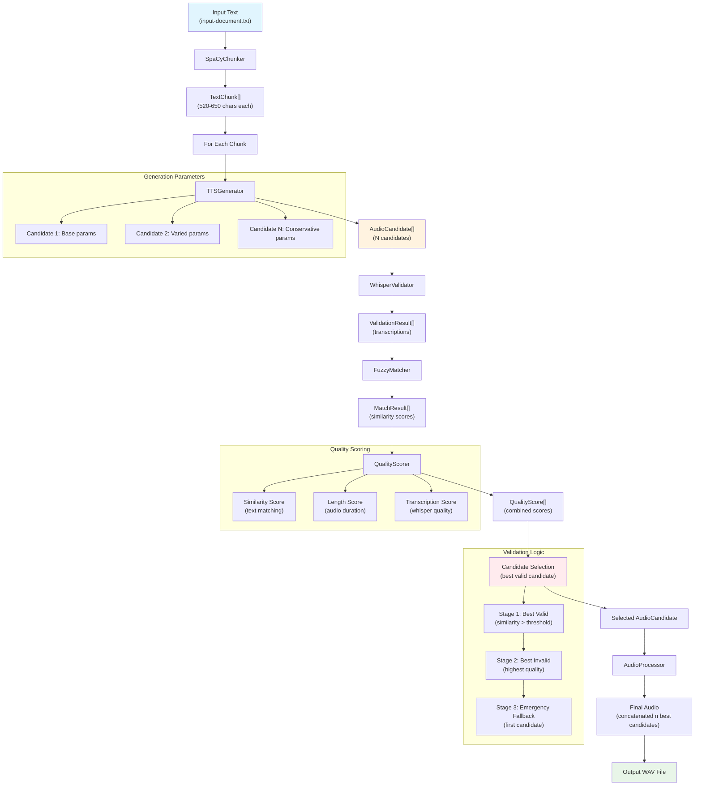

# Enhanced TTS Pipeline

An enhanced Text-to-Speech pipeline based on DEVELOPMENT_PLAN.md that implements intelligent SpaCy-based text segmentation, candidate management, Whisper validation, and audio processing.

## Prerequisites

- **Python 3.9+** (recommended: Python 3.10+)
- **Git** for cloning the repository
- **FFmpeg** (for audio processing with auto-editor)
- **CUDA** (optional, for GPU-accelerated Whisper inference)

## Quick Start

### 1. Clone Repository
```bash
git clone https://github.com/MoebiusSt/tts_pipeline_enhanced.git
cd tts_pipeline_enhanced
```

### 2. Create Virtual Environment (REQUIRED)
```bash
# Create virtual environment
python3 -m venv venv

# Activate virtual environment
# Linux/Mac:
source venv/bin/activate
# Windows:
venv\Scripts\activate
```

**⚠️ Important**: This project **must** be run in a virtual environment due to specific dependency versions (PyTorch, Transformers, etc.).

### 3. Install Dependencies
```bash
# Basic dependencies
pip install -r requirements.txt

# Download SpaCy model
python -m spacy download en_core_web_sm

# Additional dependencies for full functionality
pip install librosa perth safetensors huggingface_hub transformers einops
pip install openai-whisper python-Levenshtein fuzzywuzzy

# Optional: auto-editor for advanced audio processing
pip install auto-editor
```

### 4. Initial Testing
```bash
# Simple chunker test (without TTS)
python scripts/run_chunker.py

# Mock pipeline test (simulated audio generation for CI/CD)
python scripts/test_mock_pipeline.py

# Basic pipeline test 
python scripts/test_basic_pipeline.py

# Run integration tests
python -m pytest tests/test_integration.py -v
```

### 5. Production TTS Pipeline
```bash
# Full pipeline with real TTS (requires ChatterboxTTS)
python src/main.py
```

### 6. Command Line Options
```bash
# Standard mode (interactive)
python src/main.py                              # Execute default job
python src/main.py job1.yaml job2.yaml          # Specific job configurations (interactive for each job)
python src/main.py --job "my_job"               # Execute job with specific name

# Batch mode (non-interactive)
python src/main.py --mode last                  # Execute latest task for all jobs
python src/main.py --mode all                   # Execute all tasks for all jobs
python src/main.py --mode new                   # Create new tasks for all jobs
python src/main.py --mode last-new              # Latest task + new final audio for all jobs
python src/main.py --mode all-new               # All tasks + new final audio for all jobs

# Job-specific strategies
python src/main.py --job-mode "job1:last-new,job2:all-new,job3:last"  # Different strategies per job

# Parallel processing
python src/main.py --parallel                # Parallel task execution
python src/main.py --max-workers 4           # Adjust number of parallel workers

# Additional options
python src/main.py --verbose                 # Detailed logging / forced to be on during dev
python src/main.py --device cuda             # Force GPU execution
```

#### Execution Strategies
- **last**: Uses the latest task (Check task)
- **all**: Uses all tasks (Check tasks)
- **new**: Creates a new task
- **last-new**: Uses the latest task + new final audio
- **all-new**: Uses all tasks + new final audio

#### Interactive Selection
When no strategy is specified, the user is prompted interactively:
```
Found existing tasks for job 'my_job':
1. Task 2024-03-20_120000
2. Task 2024-03-20_110000
3. Task 2024-03-20_100000

Select action:
[Enter] - Run latest task (Check task)
n      - Create new task
a      - Run all tasks (Check tasks)
ln     - Use latest task + force new final audio
an     - Run all tasks + force new final audio
1-3    - Select specific task
c      - Cancel
```

When selecting a specific task:
```
Selected task: Task 2024-03-20_110000

What to do with this task?
[Enter] - Run task (Check task)
n      - Run task + force new final audio
c      - Cancel
```

#### Priorities
1. Job-specific strategies from `--job-mode`
2. Global strategy from `--mode`
3. Interactive selection (when no strategy specified)

## Implementierte Features

### ✅ Phase 1: Chunking-Modul
- **SpaCyChunker**: Linguistic sentence segmentation with configurable length specifications
- **ChunkValidator**: Validation of chunk lengths and sentence boundaries
- **TextChunk**: Data model with metadata (position, paragraph breaks, token estimation)

### ✅ Phase 1: Generation-Modul
- **TTSGenerator**: Wrapper for ChatterboxTTS with candidate generation
- **Intelligent Parameter Variation**: Inverse correlation between exaggeration and other parameters for more natural candidates
- **CandidateManager**: Management of multiple candidates with retry logic
- **AudioProcessor**: Concatenation of audio segments with intelligent pause processing

### ✅ Phase 2: Validation-Modul
- **WhisperValidator**: Speech-to-text validation with local Whisper integration
- **FuzzyMatcher**: Advanced text similarity calculations (multiple algorithms)
- **QualityScorer**: Multi-criteria evaluation and candidate selection

### ✅ Pipeline-Orchestrierung
- Complete end-to-end pipeline
- YAML-based configuration management
- Error handling and fallback mechanisms
- Structured logging and progress tracking

## Projektstruktur
```
tts_pipeline_enhanced/
├── config/
│   ├── default_config.yaml        # Central default configuration
│   └── example_job_config.yaml    # Example job configuration
├── src/
│   ├── main.py                    # Main pipeline script
│   ├── chunking/                  # Text segmentation
│   │   ├── base_chunker.py
│   │   └── spacy_chunker.py
│   ├── generation/                # Audio generation
│   │   ├── tts_generator.py
│   │   └── candidate_manager.py
│   ├── validation/                # Quality validation
│   │   ├── whisper_validator.py
│   │   ├── fuzzy_matcher.py
│   │   └── quality_scorer.py
│   ├── postprocessing/            # Audio post-processing
│   │   ├── auto_editor_wrapper.py
│   │   └── audio_cleaner.py
│   ├── pipeline/                  # Pipeline orchestration
│   │   ├── job_manager.py
│   │   └── task_executor.py
│   ├── preprocessor/              # Text preprocessing
│   │   └── text_preprocessor.py
│   └── utils/                     # Helper functions
│       ├── config_manager.py
│       ├── file_manager.py
│       └── logging_config.py
├── data/
│   ├── input/
│   │   ├── texts/                 # Input texts
│   │   └── reference_audio/       # Reference audio files
│   └── output/                    # Job output directories
├── scripts/
│   ├── run_chunker.py            # Standalone chunker test
│   ├── test_basic_pipeline.py    # Basic pipeline test
│   ├── test_validation_pipeline.py # Validation test
│   ├── test_postprocessing_pipeline.py # Post-processing test
│   ├── test_regenerate_final.py  # Final audio regeneration
│   ├── fix_formatting.py         # Code formatting
│   └── fix_imports.py            # Import sorting
├── .github/
│   └── workflows/
│       └── ci.yml                # CI/CD pipeline
├── docs/                         # Documentation
├── requirements.txt              # Production dependencies
├── dev-requirements.txt          # Development dependencies
└── pyproject.toml               # Project configuration
```

## Configuration

Pipeline parameters can be adjusted in `config/default_config.yaml`:
(Structure see below)

## Successful Tests

### Phase 1 (Basics)
- ✅ SpaCy-based text segmentation: 8,883 characters → 15 linguistic chunks
- ✅ Audio processing: Generation of 180.40 seconds of audio
- ✅ Configurable parameters and YAML-based settings

### Phase 2 (Validation)
- ✅ Mock candidate generation: 3 variants per chunk
- ✅ Fuzzy text matching: Multiple similarity algorithms
- ✅ Quality scoring: Multi-criteria evaluation and candidate selection
- ✅ Intelligent candidate selection: Automatic detection of best candidate

## Next Steps (Planned Extensions)

### Phase 3: Post-Processing
- [ ] AutoEditor integration for artifact removal
- [ ] NoiseAnalyzer for dynamic threshold calculation
- [ ] Advanced audio cleaning

### Phase 4: Complete Orchestration
- ✅ Job manager for complete workflow control
- ✅ Advanced error handling and recovery mechanisms
- [ ] Performance optimizations (model caching)

## Technical Improvements over Original

1. **Linguistic Segmentation**: SpaCy replaces simple character counting
2. **Multi-Candidate System**: Generation and evaluation of multiple options
3. **Whisper Validation**: Speech-to-text quality control
4. **Intelligent Selection**: Multi-criteria scoring for optimal results
5. **Modular Architecture**: Clearly separated, testable components
6. **Configurability**: YAML-based parameter control
7. **Robust Error Handling**: Graceful fallbacks and comprehensive logging
8. **Clean Code Separation**: Production pipeline without mock/test code
9. **CI/CD Integration**: Separate mock pipeline for automated tests

## Successful Tests

### Phase 1 (Basics)
- ✅ SpaCy-based text segmentation: 8,883 characters → 15 linguistic chunks
- ✅ Audio processing: Generation of 180.40 seconds of audio
- ✅ Configurable parameters and YAML-based settings

### Phase 2 (Validation)
- ✅ Mock candidate generation: 3 variants per chunk
- ✅ Fuzzy text matching: Multiple similarity algorithms
- ✅ Quality scoring: Multi-criteria evaluation and candidate selection
- ✅ Intelligent candidate selection: Automatic detection of best candidate

### Phase 3 (Post-Processing)
- [ ] NoiseAnalyzer: Noise Floor 0.028371, Confidence 0.800, Dynamic Range 27.84 dB
- [ ] AudioCleaner: Multi-stage processing (DC removal, filtering, spectral gating, compression, normalization)
- ✅ AutoEditorWrapper: Framework implemented (requires auto-editor installation)

## License

According to the original Chatterbox license.

## Technical Overview

## Architecture

The pipeline is divided into two main components:

### 1. TTS Pipeline (Core Process)
```
[Text File] → [Chunks] → [Candidates] → [Validated] → [Final Audio]
```

This linear task process is wrapped by a job/task manager that orchestrates execution. Interrupted tasks can also be resumed and completed.

### 2. Job/Task Manager (Orchestration)
```
┌─────────────────────────────────────────────────────────┐
│                     Job Manager                         │
│  ┌─────────────┐    ┌─────────────┐    ┌─────────────┐  │
│  │  Job Config │    │  Job State  │    │  Job Queue  │  │
│  └─────────────┘    └─────────────┘    └─────────────┘  │
└─────────────────────────────────────────────────────────┘
                           │
                           ▼
┌─────────────────────────────────────────────────────────┐
│                    Task Executor                        │
│  ┌─────────────┐    ┌─────────────┐    ┌─────────────┐  │
│  │Task Config  │    │Task State   │    │Task Queue   │  │
│  └─────────────┘    └─────────────┘    └─────────────┘  │
└─────────────────────────────────────────────────────────┘
                           │
                           ▼
                    [TTS Pipeline]
```

#### Job Manager
- Manages jobs as a higher-level unit, as project containers for tasks
- Stores job configurations in YAML files
- Tracks job status and progress
- Coordinates execution of multiple jobs

#### Task Executor
- Executes tasks within a job sequentially
- Automatic state detection and missing file (gap) analysis
- Intelligent recovery from errors

#### File-based State Management
- Jobs and tasks are stored as directory structure
- Each job has its own output directory
- Tasks are tracked by their output files
- Automatic resumption on interruptions

#### Configuration System
- Cascading configuration system:
  ```
  default_config.yaml
         │
         ▼
  job_config.yaml
         │
         ▼
  task_config.yaml
  ```
- Each level can override settings
- Enables flexible job and task-specific adjustments

### Detaillierter Datenfluss



### Haupt-Workflow (main.py)

```python
# Phase 1: Text Chunking
SpaCyChunker → TextChunk[] 

# Phase 2: Candidate Generation & Validation  
for each chunk:
    TTSGenerator → AudioCandidate[] (N candidates per chunk)
    WhisperValidator → ValidationResult[] 
    FuzzyMatcher → MatchResult[]
    QualityScorer → QualityScore[]
    → Select best candidate

# Phase 3: Audio Assembly
AudioProcessor → concatenate_segments() → Final Audio

# Phase 4: Output
save_audio() → WAV file
```

### Intelligent Candidate Generation

#### RAMP Strategy with Configurable Deviation Ranges
The pipeline uses an intelligent **RAMP strategy** for generating diverse audio candidates:

**Principle:**
- **Candidate 1**: Always uses exact config values for consistency
- **Additional Candidates**: Linear interpolation (RAMP) from config values to extreme values
- **Last Candidate**: Optional conservative parameters for guaranteed quality

**Parameter Behavior:**
- `exaggeration`: **RAMP-DOWN** from MAX (config) to MIN (config-max_deviation)
- `cfg_weight`: **RAMP-UP** from MIN (config) to MAX (config+max_deviation)  
- `temperature`: **RAMP-UP** from MIN (config) to MAX (config+max_deviation)

**Advantages:**
- Predictable candidate variation
- No random "wild" parameter combinations
- User-controlled min/max ranges
- Candidate 1 as reliable reference

### Kern-Klassen und Datenfluss

#### 1. Chunking Layer
```python
class SpaCyChunker:
    def chunk_text(text: str) → List[TextChunk]
    
class TextChunk:
    text: str
    start_pos: int  
    end_pos: int
    has_paragraph_break: bool
```

#### 2. Generation Layer  
```python
class TTSGenerator:
    def generate_candidates(text, num_candidates) → List[AudioCandidate]
    
class CandidateManager:
    def generate_candidates_for_chunk() → GenerationResult
    
class AudioCandidate:
    audio: torch.Tensor
    chunk_text: str
    generation_params: Dict
    candidate_id: str
```

#### 3. Validation Layer
```python
class WhisperValidator:
    def validate_candidate() → ValidationResult
    
class FuzzyMatcher:
    def match_texts() → MatchResult
    
class QualityScorer:
    def score_candidate() → QualityScore
```

#### 4. Processing Layer
```python  
class AudioProcessor:
    def concatenate_segments() → torch.Tensor
    def save_audio() → bool
```

### Wichtige Datenstrukturen

#### AudioCandidate
```python
@dataclass
class AudioCandidate:
    audio: torch.Tensor           # Generated audio tensor
    chunk_text: str              # Original text
    generation_params: Dict      # TTS parameters used
    timestamp: datetime          # Creation time
    candidate_id: str           # Unique identifier
```

#### ValidationResult
```python
@dataclass  
class ValidationResult:
    transcription: str           # Whisper transcription
    similarity_score: float      # Text similarity (0-1)
    is_valid: bool              # Passes threshold
    processing_time: float       # Validation duration
```

#### QualityScore
```python
@dataclass
class QualityScore:
    overall_score: float         # Combined score (0-1)
    similarity_score: float      # Text similarity component
    length_score: float          # Audio length component  
    transcription_score: float   # Transcription quality
```

### Algorithmus-Details

#### Multi-Candidate Generation with RAMP Strategy
```python
# Generate N candidates with configurable deviation ranges
# Candidate 1: Always uses exact config values for consistency
# Subsequent candidates: RAMP from config values to extreme values

for i in range(num_candidates):
    if i == last and conservative_enabled:
        # Conservative candidate (guaranteed quality)
        params = conservative_config
    elif i == 0:
        # First candidate: Always exact config values
        params = base_config_values
    else:
        # Subsequent candidates: RAMP strategy with configurable deviations
        ramp_position = i / (num_expressive - 1)  # 0.0 to 1.0
        
        params = {
            # exaggeration: RAMP-DOWN from MAX (config) to MIN (config-max_deviation)
            'exaggeration': base_exag - (max_exag_deviation * ramp_position),
            
            # cfg_weight: RAMP-UP from MIN (config) to MAX (config+max_deviation)  
            'cfg_weight': base_cfg + (max_cfg_deviation * ramp_position),
            
            # temperature: RAMP-UP from MIN (config) to MAX (config+max_deviation)
            'temperature': base_temp + (max_temp_deviation * ramp_position)
        }
    
    candidate = tts_model.generate(text, **params)
```

**Examples:**

**2 Candidates, Conservative Disabled:**
- Candidate 1: `{exag: 0.4, cfg: 0.3, temp: 0.8}` (exact config)
- Candidate 2: `{exag: 0.55, cfg: 0.15, temp: 0.6}` (config + deviations)

**4 Candidates, Conservative Enabled:**
- Candidate 1: `{exag: 0.4, cfg: 0.3, temp: 0.8}` (exact config)
- Candidate 2: `{exag: 0.45, cfg: 0.25, temp: 0.73}` (33% ramp)
- Candidate 3: `{exag: 0.55, cfg: 0.15, temp: 0.6}` (100% ramp)
- Candidate 4: `{exag: 0.45, cfg: 0.4, temp: 0.7}` (conservative)
```

#### Intelligent Candidate Selection
```python
# 3-Stage Fallback Logic
valid_candidates = [c for c in candidates if c.is_valid]

if valid_candidates:
    # Stage 1: Best valid candidate by quality score
    best = max(valid_candidates, key=lambda x: x.quality_score)
else:
    # Stage 2: Best invalid candidate by quality score  
    best = max(all_candidates, key=lambda x: x.quality_score)
    
# Stage 3: Emergency fallback (first candidate)
if not candidates:
    fallback_audio = torch.zeros((1, 22050))
```

#### Fuzzy Text Matching
```python
# Multiple similarity algorithms with automatic selection
methods = ["token", "partial", "ratio", "set"]
best_score = 0

for method in methods:
    score = calculate_similarity(original, transcription, method)
    best_score = max(best_score, score)
    
return MatchResult(similarity=best_score, method=best_method)
```

### Konfiguration und Parameter

#### default_config.yaml Structure
```yaml
job:
  name: "default"
  run-label: ""

input:
  reference_audio: "fry.wav"        # Dateiname im reference_audio Ordner
  text_file: "input-document.txt"   # Text-Datei im texts Ordner

preprocessing:
  enabled: true
  # Text normalization options
  normalize_line_endings: true    # Convert \r\n and \r to \n
  # Future preprocessing options can be added here
  # normalize_quotes: false
  # remove_extra_whitespace: false
  # fix_encoding_issues: false

chunking:
  target_chunk_limit: 480
  max_chunk_limit: 600
  min_chunk_length: 50
  spacy_model: "en_core_web_sm"

generation:
  num_candidates: 2
  max_retries: 2
  tts_params:
    # Base TTS parameters (candidate 1 uses these exact values)
    exaggeration: 0.40
    cfg_weight: 0.30
    temperature: 0.8
    # Maximum deviation ranges for candidate variation
    exaggeration_max_deviation: 0.15    # Range: [0.25, 0.40] (ramp DOWN from MAX)
    cfg_weight_max_deviation: 0.15      # Range: [0.30, 0.45] (ramp UP from MIN)
    temperature_max_deviation: 0.2      # Range: [0.8, 1.0] (ramp UP from MIN)
  # Conservative candidate parameters for guaranteed correctness
  conservative_candidate:
    enabled: true
    exaggeration: 0.45
    cfg_weight: 0.4
    temperature: 0.7
  
validation:
  whisper_model: "small" # "base" "small" "medium" "large"
  similarity_threshold: 0.85
  min_quality_score: 0.8

postprocessing:
  auto_editor:
    margin_before: 0.1
    margin_after: 0.1
    preserve_natural_sounds: true
  noise_threshold_factor: 1.5

audio:
  silence_duration:
    normal: 0.20
    paragraph: 0.80
  # ChatterboxTTS native sample rate - NOT a user setting!
  # This must match the actual output sample rate of ChatterboxTTS (24kHz)
  # Only change this if ChatterboxTTS itself changes its output sample rate
  sample_rate: 24000 
```

### Error Handling Strategy

#### Graceful Degradation
```python
try:
    # Generate N candidates
    candidates = generate_candidates(chunk, N)
except Exception:
    # Retry with conservative parameters
    candidates = generate_candidates(chunk, N, conservative=True)
    
if not candidates:
    # Emergency fallback
    candidates = [create_silence_candidate()]
```

### Testing Architecture

#### Mock Components
```python
# CI/CD compatible testing without heavy models
MockTTSGenerator     # Generates sine waves instead of speech
MockWhisperValidator # Returns predefined transcriptions
MockAudioProcessor   # Basic audio operations
```

#### Test Coverage
- **Unit Tests**: Individual component testing


### Development Guidelines

#### Debugging Common Issues
- **Memory Errors**: Reduce `num_candidates` in config
- **Validation Failures**: Lower `similarity_threshold` 
- **Audio Artifacts**: Fintune TTS parameters, – generate more and more diverse candidates