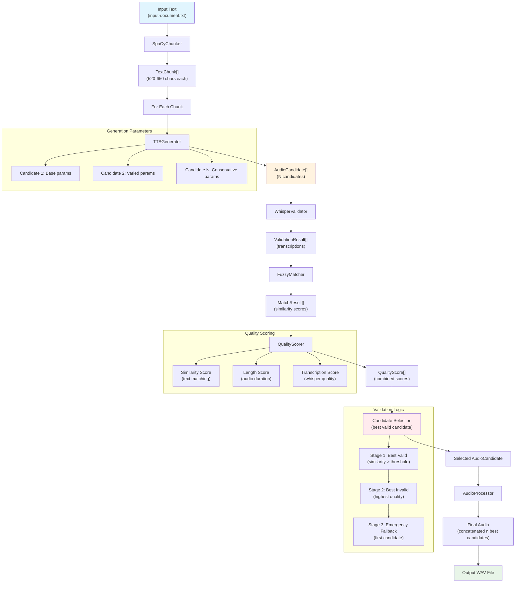

# Chatterbox Pipeline

An enhanced Text-to-Speech pipeline wrapper around resemble-ai/chatterbox

## Features
#### 📊 CLI for pipeline orchestration
- a Command Line Interface with a prompt menu system 
- CLI arguments to execute almost all functions non-interactivly. 
- YAML-based a job and task pipeline to prepare job rendering queues (like magazines or books with chapters). Configurations are cascading! Only specify what you need.
- **TTSGenerator**: Wrapper for ChatterboxTTS with candidate generation
- **SpaCyChunker**: intelligent SpaCy-based text chunking  at sentence boundaries for long text generations,  with configurable length specifications.
- **Parameter Variations**: automatic variation generation. Ramping values for exaggeration and other tts parameters to create more varied candidates
- **CandidateManager**: Management of multiple candidates with retry logic
- **Manual picking** of best candidate in simple manager
- **AudioProcessor**: Concatenation of audio segments with discerning pause processing
- **WhisperValidator**: Speech-to-text re-validation of audio-candidates with local Whisper integration
- **FuzzyMatcher**: Advanced text similarity calculations
- **QualityScorer**: Multi-criteria evaluation and best candidate selection (best match to input text)
- Complete Error handling and fallback mechanisms and structured logging and progress tracking

#### 🎭 Multi-Speaker System 
- **Dynamic Speaker Switching**: `<speaker:id>` markdown-syntax for speaker changes
- **Speaker-Specific Configurations**: Define individual reference_audio per speaker 
- **Speaker Variants**: ... or define variants (e.g., `cori_calm`, `cori_excited`) with different TTS parameters for switching speakers prosody on the fly
- See [SPEAKER_SYSTEM.md](docs/SPEAKER_SYSTEM.md) for detailed documentation.


#### ⚠️ Does not have:
- a fancy user interface

## Prerequisites

- **Python 3.9+** (recommended: Python 3.10+)
- **Git** for cloning the repository
- **CUDA** (optional, for GPU-accelerated TTS generation and Whisper validation)

## Quick Start

### 1. Clone Repository
```bash
git clone https://github.com/MoebiusSt/chatterbox-pipeline.git
cd chatterbox-pipeline
```

### 2. Create Virtual Environment (REQUIRED)
```bash
# Create virtual environment
python3 -m venv venv

# Activate virtual environment
# Linux/Mac:
source venv/bin/activate
# Windows:
venv\Scripts\activate
```

**⚠️ Important**: This project must be run in a virtual environment due to specific dependency versions (PyTorch, Transformers, etc.).

### 3. Install Dependencies
```bash
# Basic dependencies
pip install -r requirements.txt

# Download SpaCy model
python -m spacy download en_core_web_sm

# Install all dependencies
pip install -r requirements.txt

# Optional: Development dependencies (for contributors)
pip install -r dev-requirements.txt
```

### 4. Production TTS Pipeline

Pipeline parameters can be adjusted in `config/default_config.yaml`. This defines the default job. Running the main program without arguments is the same as running it with the default_config.yaml 

```bash
# Full pipeline ChatterboxTTS
python src/cbpipe.py
# Same as executing the default job in /config/default_config.yaml
python src/cbpipe.py default_config.yaml
```

### 5. Command Line Options

For an easy start you can clone the default_config.yaml in order to create a job-yaml, i.e. "myjob1.yaml". (There is a smarter way, explained below).

Any job that has never run before will be executed without interruption (without menu system). Run it like so:

```bash
# Standard mode (interactive)
python src/cbpipe.py myjob1.yaml job2.yaml          # Specific job configurations
python src/cbpipe.py --job "my_job"               # Execute job(s) with specific job-name present in a config or existing outputdirectory
python src/cbpipe.py --job "testjob*"             # Execute all jobs starting with "testjob" (pattern matching)
python src/cbpipe.py --job "test?job"             # Execute jobs matching pattern (e.g., test1job, test2job)
Shortform: -j
```
Running a job will create a 'task'.  This means, a job will create a copy of its configuration in the output directory among other files like text-chunks, audio-chunks, validation-results for this task etc. The task.yaml will look something like this:
```bash
\data\output\default\input-document_20250713_232227_config.yaml  # <-- this is a task.yaml
```
You can use it to modify a task,  re-run the job to fill deleted gaps etc. If the user runs a job or task a second time the pipeline will find all former tasks related to that job. You will be prompted interactively about the execution strategy:

#### Interactive Mode
```bash
==================================================
TTS PIPELINE - TASK-BASED EXECUTION SYSTEM
==================================================
Using device: cuda

Found existing tasks for job 'default':
1. default - no-label - input-document.txt - 13.07.2025 - 23:22 (<-- latest)
2. default - no-label - input-document.txt - 12.07.2025 - 21:11

Select action:
[Enter] - Options for latest task
n       - Create and run new task
a       - Options to run all tasks
1-1     - Options for specific task
c       - Cancel
```

#### Non-interactive mode
If you want to work non-interactivly, you can use cli arguments to specify your **execution strategy**, resembling most of the menu options.

- **last/latest**: Uses the latest task (Checks task – final audio is present? If not resumes task, if yes skips)
- **all**: Uses all tasks (Checks all tasks – final audio are present? If not resumes tasks, if yes skips)
- **new**: Creates a new task
- **last-new/new-last**: Checks latest task, resumes it, fills gaps, re-assembles new final audio
- **all-new/new-all**: Checks all tasks, resumes tasks, fills gaps, re-assembles new final audio

```bash
# Execution strategies (global):
python src/cbpipe.py --mode last or latest		# Execute latest task (again) for all given jobs.
python src/cbpipe.py --mode all					# Execute all found tasks (again) for all given jobs.
python src/cbpipe.py --mode new					# Create new task for all given jobs.
python src/cbpipe.py --mode "job1:last-new,job2:all-new,job3:latest"  # Different strategies per job
Shortform: -m

# Execution strategies with force-overwriting final audio:
python src/cbpipe.py --mode last-new or new-last   # Execute latest task + create new final audio for all given jobs. 
python src/cbpipe.py --mode all-new or new-all     # Execute all tasks + new final audios for all given jobs.
```

```bash
# Another way of globally forcing the regeneration of final audio from existing candidates, same as --mode new|last-new|all-new
python src/cbpipe.py --force-final-generation      
Shortform: -f
```
If you want to create a completly new rendering with all new audio, don't rerun a task, but use the create new task option "--mode new" instead. If you want to partially re-render an already completed task, delete some (bad) audio-chunks, and re-run the task with the "--mode last-new" or "--mode last --force-final-generation" option. This will re-render the missing files, fill in the gaps, and re-assemble the final audio.

```bash
# Gap-Filling resume of the latest task
python src/cbpipe.py myjob1.yaml --mode last --force-final-generation
or
python src/cbpipe.py myjob1.yaml --mode last-new
```
##### Combined example
```bash
python src/cbpipe.py --job "testjob*" --mode all-new --v # Create new tasks for all jobs matching "testjob*" pattern, in verbose mode
```

#####  Additional options
```bash
python src/cbpipe.py --verbose or -v             # Detailed logging
python src/cbpipe.py --device cuda               # Device selection: Force GPU execution
```
###  🚀 Try this example for fun
```bash
python src/cbpipe.py radio-broadcast.yaml
```


## License
MIT License according to the original Chatterbox license.


# Technical Overview

## Architecture

The pipeline is divided into two main components:

### 1. TTS Pipeline (Core Process)
```
[Text File] → [Chunks] → [Candidates] → [Validated] → [Final Audio]
```

This linear task process is wrapped by a job/task manager that orchestrates execution. Interrupted tasks can also be resumed and completed. For instance You can delete errornous audio chunks and re-run the tasks to completion.

### 2. Job/Task Manager (Orchestration)

#### Job Manager
- Jobs are higher-level and serve as project containers for tasks
- Stores job configurations in YAML files
- But they are basivally just a template for the tasks derived from them.
- Jobs simply group tasks by name and file folder, nothing more
- Used to coordinate execution of multiple jobs

#### Task Orchestrator
- Orchestrates task execution within a job sequentially
- Automatic state detection and missing file (gap) analysis
- Intelligent recovery from errors or interrupted tasks (no need to re-generate tons of texts that are already done.)

#### File-based State Management
- Jobs and tasks are stored as directory structure
- Each job has its own output directory
- Tasks are tracked by their output files

#### Configuration System
- Cascading configuration system:
  ```
  default_config.yaml
         │
         ▼
  job_config.yaml
         │
         ▼
  task_config.yaml
  ```
- Each level can override settings
- **3-Level Cascade**: Task configs inherit from their parent job config, which inherits from default config. Which means:
- Each _missing_ configuration line is taken from the higher level.
- Enables flexible job and task-specific adjustments without complex configs

#### Job Search and Configuration
When using `--job "switching-speakers"`, the system searches for job configurations in this order:

1. **Config directory search**: `config/*.yaml` files
   - Opens each YAML file and checks if `job:name: switching-speakers` key/value pairs can be found (With the given example files `config/speakers_example.yaml` will be found)

2. **Existing tasks search**: `data/output/{jobname}/` directory  
   - Searches for existing generated task configurations (`*_config.yaml`) from previous executions


### Main-Workflow (cbpipe.py)


```python
# Phase 1: Text Chunking
SpaCyChunker → TextChunk[] 

# Phase 2: Candidate Generation & Validation  
for each chunk:
    TTSGenerator → AudioCandidate[] (N candidates per chunk)
    WhisperValidator → ValidationResult[] 
    FuzzyMatcher → MatchResult[]
    QualityScorer → QualityScore[]
    → Select best candidate

# Phase 3: Audio Assembly
AudioProcessor → concatenate_segments() → Final Audio

# Phase 4: Output
save_audio() → WAV file
```

## About the intelligent Candidate Generation

#### RAMP Strategy with Configurable Deviation Ranges
The pipeline uses a **RAMP strategy** over N num_candidates (configurable) for generating diverse audio candidates:

**Principle:**
- **Candidate 1**: Always uses exact config values for consistency
- **Additional Candidates**: Linear interpolation (RAMP) from config values to values with deviation (configurable)
- **Last Candidate**: Optional conservative parameters from config for guaranteed valid candidate 

**Parameter Behavior:**
- `exaggeration`: **RAMP-DOWN** from MAX (config) to MIN (config - max_deviation)
- `cfg_weight`: **RAMP-UP** from MIN (config) to MAX (config + max_deviation)  
- `temperature`: **RAMP-UP** from MIN (config) to MAX (config + max_deviation)

**Advantages:**
- Predictable candidate variation
- No random "wild" parameter combinations
- User-controlled min/max ranges
- 1 Candidate is at least exact or reliable reference (configurable with less temperature, higher min_p, lower top_p)

#### Algorythm details

```python
# Generate N candidates with configurable deviation ranges
# Candidate 1: Always uses exact config values for consistency
# Subsequent candidates: RAMP from config values to extreme values

for i in range(num_candidates):
    if i == last and conservative_enabled:
        # Conservative candidate (guaranteed quality)
        params = conservative_config
    elif i == 0:
        # First candidate: Always exact config values
        params = base_config_values
    else:
        # Subsequent candidates: RAMP strategy with configurable deviations
        ramp_position = i / (num_expressive - 1)  # 0.0 to 1.0
        
        params = {
            # exaggeration: RAMP-DOWN from MAX (config) to MIN (config-max_deviation)
            'exaggeration': base_exag - (max_exag_deviation * ramp_position),
            
            # cfg_weight: RAMP-UP from MIN (config) to MAX (config+max_deviation)  
            'cfg_weight': base_cfg + (max_cfg_deviation * ramp_position),
            
            # temperature: RAMP-UP from MIN (config) to MAX (config+max_deviation)
            'temperature': base_temp + (max_temp_deviation * ramp_position)
        }
    
    candidate = tts_model.generate(text, **params)
```

**Examples:**

**2 Candidates, Conservative Disabled:**
- Candidate 1: `{exag: 0.4, cfg: 0.3, temp: 0.8}` (exact config)
- Candidate 2: `{exag: 0.55, cfg: 0.15, temp: 0.6}` (config + deviations)

**4 Candidates, Conservative Enabled:**
- Candidate 1: `{exag: 0.4, cfg: 0.3, temp: 0.8}` (exact config)
- Candidate 2: `{exag: 0.45, cfg: 0.25, temp: 0.73}` (33% ramp)
- Candidate 3: `{exag: 0.55, cfg: 0.15, temp: 0.6}` (100% ramp)
- Candidate 4: `{exag: 0.45, cfg: 0.4, temp: 0.7}` (conservative)

## Candidates Selection
```python
# 3-Stage Fallback Logic
valid_candidates = [c for c in candidates if c.is_valid]

if valid_candidates:
    # Stage 1: Best valid candidate by quality score
    best = max(valid_candidates, key=lambda x: x.quality_score)
else:
    # Stage 2: Best invalid candidate by quality score  
    best = max(all_candidates, key=lambda x: x.quality_score)
    
	# Stage 3: Emergency fallback (first candidate)
if not candidates:
    fallback_audio = torch.zeros((1, 22050))
```

#### Fuzzy Text Matching
```python
# Multiple similarity algorithms with automatic selection
methods = ["token", "partial", "ratio"]
best_score = 0

for method in methods:
    score = calculate_similarity(original, transcription, method)
    best_score = max(best_score, score)
    
return MatchResult(similarity=best_score, method=best_method)
```

### Configuration and Parameters

#### Multi-Speaker System

The TTS system supports multiple speakers with dynamic switching of voices and TTS generation parameters. You can setup a list of speakers in default_config.yaml, or you can define new lists of speakers in any job-config.yaml file:

**Speaker IDs:**
- Arbitrary strings for any named speakers (e.g. narrator, character)
- The first defined speaker will be the default and fallback speaker

**Markup syntax for speaker switching:**
input text:
```text
Some text at the beginning without markup will be read by default speaker.
<speaker:narrator>
Narrator takes over here.
<speaker:character>
Text read by character
<speaker:character-hectic>
Text read by character with different tts_parameters.
<speaker:default>
Back to the default speaker.
```

**Internal logic:**
<speaker:0>, <speaker:default>, <speaker:reset> → all can be used as aliases to switch to default speaker 
Any unknown IDs will fallback to default speaker, too.

#### default_config.yaml Structure
```yaml
job:
  name: default
  run-label: ""

input:
  text_file: input-document.txt   # Text file in the texts folder

preprocessing:
  enabled: true
  normalize_line_endings: true    # Convert \r\n and \r to \n
  # Future preprocessing options might be added here

chunking:
  target_chunk_limit: 380
  max_chunk_limit: 460
  min_chunk_length: 50
  spacy_model: en_core_web_sm

generation:
  num_candidates: 3
  max_retries: 1
  speakers:
    - id: default                   # Default speaker - use default or any custom name
      reference_audio: fry.wav      # File name in data/input/reference_audio folder
      tts_params:
        # Base TTS parameters - these define the STARTING POINTS for candidate ramping:
        # - exaggeration: MAX value (ramps DOWN from here)
        # - cfg_weight: MIN value (ramps UP from here)  
        # - temperature: MIN value (ramps UP from here)
        exaggeration: 0.40                  # MAX: give maximum here
        exaggeration_max_deviation: 0.20    # Range: (ramp DOWN) [exaggeration, exaggeration-exag_max_deviation] 
        cfg_weight: 0.2                     # MIN: give minimum
        cfg_weight_max_deviation: 0.20      # Range: (ramp UP) [cfg_weight, cfg_weight+max_dev] 
        temperature: 0.9                    # MIN: give minimum
        temperature_max_deviation: 0.3      # Range: (ramp UP) [temp, temp+max_dev] 
        min_p: 0.03                         # Minimum probability threshold for token sampling
        top_p: 0.99                         # Top-p (nucleus) sampling threshold
        
      # Conservative candidate parameters for guaranteed valid canidate
      conservative_candidate:
        enabled: true
        exaggeration: 0.40
        cfg_weight: 0.2
        temperature: 0.8
        min_p: 0.08    # a little bit higher than default 0.05 for less "creativity" but more stability
        top_p: 0.9    # a little lower than default 1.0 for less variation but added stability
    
  
validation:
  whisper_model: small # base small medium large
  similarity_threshold: 0.8
  min_quality_score: 0.75

audio:
  silence_duration:
    normal: 0.20
    paragraph: 0.80
  # ChatterboxTTS native sample rate - NOT a user setting!
  # This must match the actual output sample rate of ChatterboxTTS (24kHz)
  # Only change this if ChatterboxTTS itself changes its output sample rate
  sample_rate: 24000 
```

```yaml
# For higher consistency, less artifacts, but also less creative prosody:
min_p: 0.08-0.12
top_p: 0.90-0.96
# For balanced results:
min_p: 0.05-0.07
top_p: 0.95-0.98
# For creative natural prosody, but risking artefacts:
min_p: 0.02-0.04
top_p: 0.98-1.0
```
### Debugging Common Issues
- **Memory Errors**: Reduce `num_candidates` in config
- **Validation Failures**: Lower `similarity_threshold` 
- **Audio Artifacts**: Fintune TTS parameters, – generate more and more diverse candidates