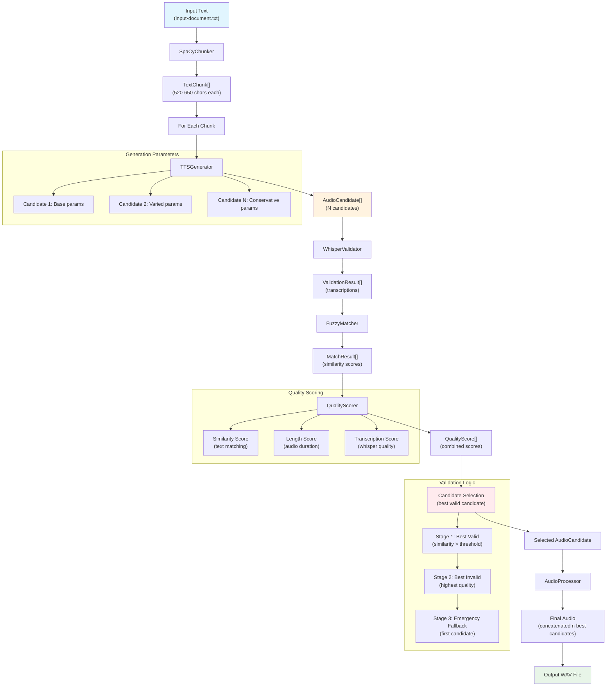

# Enhanced TTS Pipeline

An enhanced Text-to-Speech pipeline based on resemble-ai/chatterbox that implements:
- intelligent SpaCy-based text chunking for longer generations, 
- automatic variaten generation, 
- automatic Whisper validation or 
- manual candidate management for best-candidate selection, 
- a job and task pipeline to prepare job renderings like magazine articles or books with chapters, 
- speakers configuration and markdown-syntax for switching speakers or prosody on the fly
- a CLI with a prompt menu system 
- CLI arguments to execute almost all function. 

Does not have:
- a fancy user interface
- extensive documentation or help texts

## Prerequisites

- **Python 3.9+** (recommended: Python 3.10+)
- **Git** for cloning the repository
- **CUDA** (optional, for GPU-accelerated Whisper inference)

## Quick Start

### 1. Clone Repository
```bash
git clone https://github.com/MoebiusSt/tts_pipeline_enhanced.git
cd tts_pipeline_enhanced
```

### 2. Create Virtual Environment (REQUIRED)
```bash
# Create virtual environment
python3 -m venv venv

# Activate virtual environment
# Linux/Mac:
source venv/bin/activate
# Windows:
venv\Scripts\activate
```

**⚠️ Important**: This project **must** be run in a virtual environment due to specific dependency versions (PyTorch, Transformers, etc.).

### 3. Install Dependencies
```bash
# Basic dependencies
pip install -r requirements.txt

# Download SpaCy model
python -m spacy download en_core_web_sm

# Additional dependencies for full functionality
pip install librosa perth safetensors huggingface_hub transformers einops
pip install openai-whisper fuzzywuzzy

pip install -r requirements.txt
pip install -r dev-requirements.txt
```

### 4. Production TTS Pipeline
```bash
# Full pipeline with real TTS (requires ChatterboxTTS)
python src/main.py
```

### 5. Command Line Options
```bash
# Standard mode (interactive)
python src/main.py                              # Execute default job from /config/default_config.yaml
python src/main.py job1.yaml job2.yaml          # Specific job configurations (interactive for each job)
python src/main.py --job "my_job"               # Execute job with specific name present in a config or existing outputdirectory
python src/main.py --job "testjob*"             # Execute all jobs starting with "testjob" (pattern matching)
python src/main.py --job "test?job"             # Execute jobs matching pattern (e.g., test1job, test2job)
Shortform: -j
```

```bash
# Execution strategies (global):
python src/main.py --mode last or latest # Execute latest task (again) for all given jobs.
python src/main.py --mode all                    # Execute all found tasks (again) for all given jobs.
python src/main.py --mode new                    # Create new task for all given jobs.
python src/main.py --mode "job1:last-new,job2:all-new,job3:latest"  # Different strategies per job
Shortform: -m

# Execution strategies with force-overwriting final audio:
python src/main.py --mode last-new or new-last   # Execute latest task + create new final audio for all given jobs. 
python src/main.py --mode all-new or new-all     # Execute all tasks + new final audios for all given jobs.
```

```bash
# Force regeneration
python src/main.py --force-final-generation      # Another way of globally forcing the regeneration of final audio from existing candidates, same as --mode new|last-new|all-new
Shortform: -f
```

```bash
# Device selection
python src/main.py --device cuda               # Force GPU execution
```

```bash
# Additional options
python src/main.py --verbose or -v             # Detailed logging
```

```bash
# Combined examples
python src/main.py --job "my_job" --verbose     # Job with verbose logging
python src/main.py --job "job1" --mode last-new   # Complete check of last task from "job1" and overwriting final audio.
python src/main.py --job "testjob*" --mode all-new --v # Create new tasks for all jobs matching "testjob*" pattern
```

#### Note: 
If you want to create a complete new render with all new audio, don't rerun a task, but use a new task instead.
If you want to partially re-render an already completed task, delete some (bad) audio-chunks, and re-run the task with the "--mode new" option. This will re-render the missing files, fill in the gaps, and re-assemble the final audio.


#### Execution Strategies
- **last/latest**: Uses the latest task (Checks task – final audio is present? If not resumes task, if yes skips)
- **all**: Uses all tasks (Checks all tasks – final audio are present? If not resumes tasks, if yes skips)
- **new**: Creates a new task
- **last-new/new-last**: Checks latest task, resumes it, fills gaps, re-assembles new final audio
- **all-new/new-all**: Checks all tasks, resumes tasks, fills gaps, re-assembles new final audio

#### Interactive Selection
When no strategy is specified, the user is prompted interactively:

```
Found existing tasks for job 'my_job':
1. Task 2024-03-20_120000
2. Task 2024-03-20_110000
3. Task 2024-03-20_100000

Select action:
[Enter] - Run latest task (Check task)
n      - Create new task
a      - Run all tasks (Check tasks)
ln     - Use latest task + force new final audio
an     - Run all tasks + force new final audio
1-3    - Select specific task
c      - Cancel
```

## Implemented features

### ✅ Phase 1: Chunking-Modul
- **SpaCyChunker**: Sentence segmentation with configurable length specifications
- **ChunkValidator**: Validation of chunk lengths and sentence boundaries
- **TextChunk**: Data model with metadata (position, paragraph breaks)

### ✅ Phase 1: Generation-Modul
- **TTSGenerator**: Wrapper for ChatterboxTTS with candidate generation
- **Intelligent Parameter Variations**: Inverse correlation between exaggeration and other parameters for more natural candidates
- **CandidateManager**: Management of multiple candidates with retry logic
- **AudioProcessor**: Concatenation of audio segments with discerning pause processing

### ✅ Phase 2: Validation-Modul
- **WhisperValidator**: Speech-to-text re-validation with local Whisper integration
- **FuzzyMatcher**: Advanced text similarity calculations
- **QualityScorer**: Multi-criteria evaluation and best candidate selection (best match to input text)

### ✅ Multi-Speaker System 🎭
- **Dynamic Speaker Switching**: `<speaker:id>` markup syntax for speaker changes
- **Speaker-Specific Configurations**: Define individual reference_audio and TTS parameters per speaker
- **Speaker Variants**: or is it to define variants (e.g., `cori_calm`, `cori_excited`) with different TTS parameters
- **Speaker-Aware Chunking**: Speaker transitions have highest priority in text segmentation

See [SPEAKER_SYSTEM.md](SPEAKER_SYSTEM.md) for detailed documentation.

### ✅ Pipeline orchestration
- YAML-based job and task configuration management
- Complete Error handling and fallback mechanisms
- Structured logging and progress tracking

## Project structure
```
tts_pipeline_enhanced/
├── config/
│   ├── __init__.py
│   ├── default_config.yaml        # Central default configuration
│   └── example_job_config.yaml    # Example job configuration
├── data/
│   ├── input/
│   │   ├── reference_audio/       # Reference audio files
│   │   │   └── stephan_moebius.wav
│   │   └── texts/                 # Input texts
│   │       └── input-document.txt
│   └── output/                    # Job output directories
├── logs/                           # main.log
├── scripts/                        # Unit Tests
├── src/
│   ├── __init__.py
│   ├── chunking/                  # Text segmentation
│   │   ├── __init__.py
│   │   ├── base_chunker.py
│   │   ├── chunk_validator.py
│   │   └── spacy_chunker.py
│   ├── config/
│   │   ├── __init__.py
│   │   └── github_config.py
│   ├── generation/                # Audio generation
│   │   ├── __init__.py
│   │   ├── audio_processor.py
│   │   ├── batch_processor.py
│   │   ├── candidate_manager.py
│   │   ├── model_cache.py
│   │   ├── selection_strategies.py
│   │   └── tts_generator.py
│   ├── main.py                    # Main pipeline script
│   ├── pipeline/                  # Pipeline orchestration
│   │   ├── __init__.py
│   │   ├── batch_task_executor.py
│   │   ├── job_manager/
│   │   │   ├── ...
│   │   ├── job_manager_wrapper.py
│   │   ├── task_executor/
│   │   │   ├── __init__.py
│   │   │   ├── retry_logic.py
│   │   │   ├── stage_handlers/
│   │   │   │   ├── ...
│   │   │   └── task_executor.py
│   │   └── task_executor_original.py
│   ├── preprocessor/              # Text preprocessing
│   │   ├── __init__.py
│   │   └── text_preprocessor.py
│   └── utils/                     # Helper functions
│       ├── __init__.py
│       ├── audio_utils.py
│       ├── config_manager.py
│       ├── file_manager/
│       │   ├── __init__.py
│       │   ├── file_manager.py
│       │   ├── io_handlers/
│       │   │   ├── ...
│       │   ├── state_analyzer.py
│       │   └── validation_helpers.py
│       ├── file_manager.py
│       ├── logging_config.py
│       └── progress_tracker.py
├── candidate_quality_scorer_diagram.md
├── CONTRIBUTING.md
├── dev-requirements.txt          # Development dependencies
├── DEVELOPMENT_PLAN.md
├── mermaid_diagram.md
├── mypy.ini
├── pyproject.toml               # Project configuration
├── README.md
├── requirements.txt              # Production dependencies
└── TECHNICAL_OVERVIEW.md
```

## Configuration

Pipeline parameters can be adjusted in `config/default_config.yaml`:
(Structure see below)

## Technical Improvements over Original

1. **Linguistic Segmentation**: SpaCy replaces simple character counting
2. **Multi-Candidate System**: Generation and evaluation of multiple options
3. **Whisper Validation**: Speech-to-text quality control
4. **Intelligent Selection**: Multi-criteria scoring for optimal results
5. **Modular Architecture**: Clearly separated, testable components
6. **Configurability**: YAML-based parameter control
7. **Robust Error Handling**: Graceful fallbacks and comprehensive logging
8. **Clean Code Separation**:
9. **CI/CD Integration**: Separate mock pipeline for automated tests


## License
According to the original Chatterbox license.


# Technical Overview

## Architecture

The pipeline is divided into two main components:

### 1. TTS Pipeline (Core Process)
```
[Text File] → [Chunks] → [Candidates] → [Validated] → [Final Audio]
```

This linear task process is wrapped by a job/task manager that orchestrates execution. Interrupted tasks can also be resumed and completed. For instance You can delete errornous audio chunks and re-run the tasks to completion.

### 2. Job/Task Manager (Orchestration)
```
┌─────────────────────────────────────────────────────────┐
│                     Job Manager                         │
│  ┌─────────────┐    ┌─────────────┐    ┌─────────────┐  │
│  │  Job Config │    │  Job State  │    │  Job Queue  │  │
│  └─────────────┘    └─────────────┘    └─────────────┘  │
└─────────────────────────────────────────────────────────┘
                           │
                           ▼
┌─────────────────────────────────────────────────────────┐
│                    Task Executor                        │
│  ┌─────────────┐    ┌─────────────┐    ┌─────────────┐  │
│  │Task Config  │    │Task State   │    │Task Queue   │  │
│  └─────────────┘    └─────────────┘    └─────────────┘  │
└─────────────────────────────────────────────────────────┘
                           │
                           ▼
                    [TTS Pipeline]
```

#### Job Manager
- Jobs are higher-level and serve as project containers for tasks
- Stores job configurations in YAML files
- But they are basivally just a template for the tasks derived from them.
- Jobs simply group taks by name and filefolder, nothing more
- Used to coordinate execution of multiple jobs

#### Task Executor
- Executes tasks within a job sequentially
- Automatic state detection and missing file (gap) analysis
- Intelligent recovery from errors or interrupted tasks (no need to re-generate tons of text that are already done.)

#### File-based State Management
- Jobs and tasks are stored as directory structure
- Each job has its own output directory
- Tasks are tracked by their output files

#### Configuration System
- Cascading configuration system:
  ```
  default_config.yaml
         │
         ▼
  job_config.yaml
         │
         ▼
  task_config.yaml
  ```
- Each level can override settings
- **3-Level Cascade**: Task configs inherit from their parent job config, which inherits from default config. Which means:
- Each missing configuration line is taken from the higher level.
- Enables flexible job and task-specific adjustments

#### Job Search and Configuration
When using `--job "jobname"`, the system searches for job configurations in this order:

1. **Config directory search**: `config/*.yaml` files
   - Opens each YAML file and checks if `job.name` matches the search term
   - Example: `config/my_project_config.yaml` with `job.name: "my_project"`

2. **Existing tasks search**: `data/output/{jobname}/` directory  
   - Searches for existing task configurations (`*_config.yaml`)
   - These are generated task files from previous executions


### Detailed data flow



### Main-Workflow (main.py)

```python
# Phase 1: Text Chunking
SpaCyChunker → TextChunk[] 

# Phase 2: Candidate Generation & Validation  
for each chunk:
    TTSGenerator → AudioCandidate[] (N candidates per chunk)
    WhisperValidator → ValidationResult[] 
    FuzzyMatcher → MatchResult[]
    QualityScorer → QualityScore[]
    → Select best candidate

# Phase 3: Audio Assembly
AudioProcessor → concatenate_segments() → Final Audio

# Phase 4: Output
save_audio() → WAV file
```

### Intelligent Candidate Generation

#### RAMP Strategy with Configurable Deviation Ranges
The pipeline uses a **RAMP strategy** for generating diverse audio candidates:

**Principle:**
- **Candidate 1**: Always uses exact config values for consistency
- **Additional Candidates**: Linear interpolation (RAMP) from config values to values with deviation (configurable)
- **Last Candidate**: Optional conservative parameters form config for guaranteed quality

**Parameter Behavior:**
- `exaggeration`: **RAMP-DOWN** from MAX (config) to MIN (config - max_deviation)
- `cfg_weight`: **RAMP-UP** from MIN (config) to MAX (config + max_deviation)  
- `temperature`: **RAMP-UP** from MIN (config) to MAX (config + max_deviation)

**Advantages:**
- Predictable candidate variation
- No random "wild" parameter combinations
- User-controlled min/max ranges
- 1 Candidate is at least exact or reliable reference (configurable)

### Kern-Klassen und Datenfluss

#### 1. Chunking Layer
```python
class SpaCyChunker:
    def chunk_text(text: str) → List[TextChunk]
    
class TextChunk:
    text: str
    start_pos: int  
    end_pos: int
    has_paragraph_break: bool
```

#### 2. Generation Layer  
```python
class TTSGenerator:
    def generate_candidates(text, num_candidates) → List[AudioCandidate]
    
class CandidateManager:
    def generate_candidates_for_chunk() → GenerationResult
    
class AudioCandidate:
    audio: torch.Tensor
    chunk_text: str
    generation_params: Dict
    candidate_id: str
```

#### 3. Validation Layer
```python
class WhisperValidator:
    def validate_candidate() → ValidationResult
    
class FuzzyMatcher:
    def match_texts() → MatchResult
    
class QualityScorer:
    def score_candidate() → QualityScore
```

#### 4. Processing Layer
```python  
class AudioProcessor:
    def concatenate_segments() → torch.Tensor
    def save_audio() → bool
```

### Wichtige Datenstrukturen

#### AudioCandidate
```python
@dataclass
class AudioCandidate:
    audio: torch.Tensor           # Generated audio tensor
    chunk_text: str              # Original text
    generation_params: Dict      # TTS parameters used
    timestamp: datetime          # Creation time
    candidate_id: str           # Unique identifier
```

#### ValidationResult
```python
@dataclass  
class ValidationResult:
    transcription: str           # Whisper transcription
    similarity_score: float      # Text similarity (0-1)
    is_valid: bool              # Passes threshold
    processing_time: float       # Validation duration
```

#### QualityScore
```python
@dataclass
class QualityScore:
    overall_score: float         # Combined score (0-1)
    similarity_score: float      # Text similarity component
    length_score: float          # Audio length component  
    transcription_score: float   # Transcription quality
```

### Algorythm details

#### Multi-Candidate Generation with RAMP Strategy
```python
# Generate N candidates with configurable deviation ranges
# Candidate 1: Always uses exact config values for consistency
# Subsequent candidates: RAMP from config values to extreme values

for i in range(num_candidates):
    if i == last and conservative_enabled:
        # Conservative candidate (guaranteed quality)
        params = conservative_config
    elif i == 0:
        # First candidate: Always exact config values
        params = base_config_values
    else:
        # Subsequent candidates: RAMP strategy with configurable deviations
        ramp_position = i / (num_expressive - 1)  # 0.0 to 1.0
        
        params = {
            # exaggeration: RAMP-DOWN from MAX (config) to MIN (config-max_deviation)
            'exaggeration': base_exag - (max_exag_deviation * ramp_position),
            
            # cfg_weight: RAMP-UP from MIN (config) to MAX (config+max_deviation)  
            'cfg_weight': base_cfg + (max_cfg_deviation * ramp_position),
            
            # temperature: RAMP-UP from MIN (config) to MAX (config+max_deviation)
            'temperature': base_temp + (max_temp_deviation * ramp_position)
        }
    
    candidate = tts_model.generate(text, **params)
```

**Examples:**

**2 Candidates, Conservative Disabled:**
- Candidate 1: `{exag: 0.4, cfg: 0.3, temp: 0.8}` (exact config)
- Candidate 2: `{exag: 0.55, cfg: 0.15, temp: 0.6}` (config + deviations)

**4 Candidates, Conservative Enabled:**
- Candidate 1: `{exag: 0.4, cfg: 0.3, temp: 0.8}` (exact config)
- Candidate 2: `{exag: 0.45, cfg: 0.25, temp: 0.73}` (33% ramp)
- Candidate 3: `{exag: 0.55, cfg: 0.15, temp: 0.6}` (100% ramp)
- Candidate 4: `{exag: 0.45, cfg: 0.4, temp: 0.7}` (conservative)
```

#### Intelligent Candidate Selection
```python
# 3-Stage Fallback Logic
valid_candidates = [c for c in candidates if c.is_valid]

if valid_candidates:
    # Stage 1: Best valid candidate by quality score
    best = max(valid_candidates, key=lambda x: x.quality_score)
else:
    # Stage 2: Best invalid candidate by quality score  
    best = max(all_candidates, key=lambda x: x.quality_score)
    
# Stage 3: Emergency fallback (first candidate)
if not candidates:
    fallback_audio = torch.zeros((1, 22050))
```

#### Fuzzy Text Matching
```python
# Multiple similarity algorithms with automatic selection
methods = ["token", "partial", "ratio", "set"]
best_score = 0

for method in methods:
    score = calculate_similarity(original, transcription, method)
    best_score = max(best_score, score)
    
return MatchResult(similarity=best_score, method=best_method)
```

### Configuration and Parameters

#### Multi-Speaker System

The TTS system supports multiple speakers with dynamic switching of voices and TTS generation parameters. You can setup a list of speakers in default_config.yaml, or you can define new lists of speakers in any job-config.yaml file:

**Speaker IDs:**
- Arbitrary strings for any named speakers (e.g. narrator, character)
- The first defined speaker will be the default and fallback speaker

**Markup syntax for speaker switching:**
```text
Some text without markup will be read by default speaker.

<speaker:narrator>
Narrator takes over here.

<speaker:character>
Text read by character

<speaker:character-hectic>
Text read by character with different tts_parameters.

<speaker:default>
Back to the default speaker.
```

**Internal logic:**
<speaker:0>, <speaker:default>, <speaker:reset> → all can be used to switch to default speaker 
- Unknown IDs will fallback to default speaker

#### default_config.yaml Structure
```yaml
job:
  name: default
  run-label: ""

input:
  text_file: input-document.txt   # Text file in the texts folder

preprocessing:
  enabled: true
  normalize_line_endings: true    # Convert \r\n and \r to \n
  # Future preprocessing options might be added here

chunking:
  target_chunk_limit: 380
  max_chunk_limit: 460
  min_chunk_length: 50
  spacy_model: en_core_web_sm

generation:
  num_candidates: 3
  max_retries: 1
  speakers:
    - id: default                   # Default speaker - use default or any custom name
      reference_audio: fry.wav      # File name in data/input/reference_audio folder
      tts_params:
        # Base TTS parameters - these define the STARTING POINTS for candidate ramping:
        # - exaggeration: MAX value (ramps DOWN from here)
        # - cfg_weight: MIN value (ramps UP from here)  
        # - temperature: MIN value (ramps UP from here)
        exaggeration: 0.40                  # MAX: give maximum here
        exaggeration_max_deviation: 0.20    # Range: (ramp DOWN) [exaggeration, exaggeration-exag_max_deviation] 
        cfg_weight: 0.2                    # MIN: give minimum
        cfg_weight_max_deviation: 0.20      # Range: (ramp UP) [cfg_weight, cfg_weight+max_dev] 
        temperature: 0.9                    # MIN: give minimum
        temperature_max_deviation: 0.3      # Range: (ramp UP) [temp, temp+max_dev] 
        
      # Conservative candidate parameters for guaranteed correctness
      conservative_candidate:
        enabled: true
        exaggeration: 0.40
        cfg_weight: 0.2
        temperature: 0.8
    
  
validation:
  whisper_model: small # base small medium large
  similarity_threshold: 0.8
  min_quality_score: 0.75

audio:
  silence_duration:
    normal: 0.20
    paragraph: 0.80
  # ChatterboxTTS native sample rate - NOT a user setting!
  # This must match the actual output sample rate of ChatterboxTTS (24kHz)
  # Only change this if ChatterboxTTS itself changes its output sample rate
  sample_rate: 24000 
```

### Testing Architecture

#### Mock Components
```python
# CI/CD compatible testing without heavy models
MockTTSGenerator     # Generates sine waves instead of speech
MockWhisperValidator # Returns predefined transcriptions
MockAudioProcessor   # Basic audio operations
```

#### Test Coverage
- **Unit Tests**: Individual component testing

#### Debugging Common Issues
- **Memory Errors**: Reduce `num_candidates` in config
- **Validation Failures**: Lower `similarity_threshold` 
- **Audio Artifacts**: Fintune TTS parameters, – generate more and more diverse candidates