# TTS Pipeline - Task-Based Architecture (Improved)

```mermaid
graph TD
    %% Entry Points & Argument Processing
    START[Program Start] --> ARGS[Parse Arguments]
    ARGS --> ARG_TYPE{Argument Type}
    ARG_TYPE --> |No Args| DEFAULT_JOB[Load Default Job]
    ARG_TYPE --> |Config Files| CONFIG_FILES[Process Config Files]
    ARG_TYPE --> |--job name| JOB_NAME[Find Job by Name]
    
    %% Config Processing & Job Resolution
    DEFAULT_JOB --> JOB_MANAGER[Job Manager<br/>Pipeline Orchestrator]
    CONFIG_FILES --> IS_TASK{is_task_config?}
    IS_TASK -->|Yes| DIRECT_TASK[Execute Task Directly]
    IS_TASK -->|No| FIND_EXISTING[get_jobs<br/>Find Existing Tasks]
    JOB_NAME --> FIND_EXISTING
    
    %% Task Selection & Creation
    FIND_EXISTING --> EXISTING_TASKS{Existing Tasks<br/>Found?}
    EXISTING_TASKS -->|Yes| USER_SELECT[User Selection<br/>Latest/New/All/Cancel]
    EXISTING_TASKS -->|No| CREATE_TASK[Create New Task]
    USER_SELECT -->|Latest/Specific| SELECTED_TASK[Load Selected Task]
    USER_SELECT -->|New| CREATE_TASK
    USER_SELECT -->|All| BATCH_TASKS[Process All Tasks]
    USER_SELECT -->|Cancel| END_CANCEL[Cancelled]
    
    %% Task Creation Process
    CREATE_TASK --> CASCADE_CONFIG[Cascading Config Merge<br/>job-yaml + default-yaml]
    CASCADE_CONFIG --> SAVE_TASK_CONFIG[save_config<br/>Create task-yaml]
    SAVE_TASK_CONFIG --> TASK_READY[Task Ready for Execution]
    
    %% Unified Task Execution Pipeline
    DIRECT_TASK --> TASK_EXECUTOR[Unified Task Executor]
    SELECTED_TASK --> TASK_EXECUTOR
    TASK_READY --> TASK_EXECUTOR
    JOB_MANAGER --> TASK_EXECUTOR
    
    %% Automatic State Detection & Gap Analysis
    TASK_EXECUTOR --> CRUD_INIT[Initialize CRUD Classes<br/>FileManager, ConfigManager]
    CRUD_INIT --> STATE_ANALYSIS[Automatic State Detection<br/>& Gap Analysis]
    STATE_ANALYSIS --> GAP_RESULT{Gap Analysis<br/>Result}
    
    %% Task Execution Paths Based on Gap Analysis
    GAP_RESULT -->|Complete| TASK_COMPLETE[Task Already Complete]
    GAP_RESULT -->|Missing Preprocessing| EXEC_PREPROCESS[Execute Preprocessing]
    GAP_RESULT -->|Missing Generation| EXEC_GENERATION[Execute Generation]
    GAP_RESULT -->|Missing Validation| EXEC_VALIDATION[Execute Validation]
    GAP_RESULT -->|Missing Assembly| EXEC_ASSEMBLY[Execute Assembly]
    
    %% Preprocessing Stage
    EXEC_PREPROCESS --> LOAD_INPUT[get_input_text]
    LOAD_INPUT --> TEXT_CHUNK[Text Chunking<br/>SpaCyChunker]
    TEXT_CHUNK --> SAVE_CHUNKS[save_chunks]
    SAVE_CHUNKS --> EXEC_GENERATION
    
    %% Generation Stage
    EXEC_GENERATION --> LOAD_CHUNKS[get_chunks]
    LOAD_CHUNKS --> TTS_GEN[TTS Generation<br/>TTSGenerator]
    TTS_GEN --> SAVE_CANDIDATES[save_candidates]
    SAVE_CANDIDATES --> EXEC_VALIDATION
    
    %% Validation Stage
    EXEC_VALIDATION --> LOAD_CANDIDATES[get_candidates]
    LOAD_CANDIDATES --> WHISPER_VAL[Whisper Validation<br/>WhisperValidator]
    WHISPER_VAL --> SAVE_WHISPER[save_whisper]
    SAVE_WHISPER --> QUALITY_SCORE[Quality Scoring<br/>QualityScorer]
    QUALITY_SCORE --> SAVE_METRICS[save_metrics]
    SAVE_METRICS --> EXEC_ASSEMBLY
    
    %% Assembly Stage
    EXEC_ASSEMBLY --> LOAD_METRICS[get_metrics]
    LOAD_METRICS --> SELECT_BEST[Select Best Candidates]
    SELECT_BEST --> LOAD_AUDIO[get_audio_segments]
    LOAD_AUDIO --> ASSEMBLE[Audio Assembly<br/>Concatenation + Silence]
    ASSEMBLE --> SAVE_FINAL[save_final_audio]
    SAVE_FINAL --> TASK_COMPLETE
    
    %% Batch Processing
    BATCH_TASKS --> BATCH_EXECUTOR[Batch Task Executor]
    BATCH_EXECUTOR --> TASK_QUEUE[Task Queue Processing]
    TASK_QUEUE --> TASK_EXECUTOR
    TASK_EXECUTOR --> BATCH_NEXT{More Tasks<br/>in Queue?}
    BATCH_NEXT -->|Yes| TASK_QUEUE
    BATCH_NEXT -->|No| BATCH_COMPLETE[All Tasks Complete]
    
    %% Completion & Error Handling
    TASK_COMPLETE --> LOG_RESULTS[Log Task Results]
    LOG_RESULTS --> CLEANUP[Cleanup & Finalization]
    CLEANUP --> END[Task/Job Complete]
    BATCH_COMPLETE --> END
    END_CANCEL --> END
    
    %% Central CRUD Operations (Persistent)
    CRUD_STORAGE[(Central CRUD Classes<br/>FileManager, ConfigManager<br/>DataManager)]
    LOAD_INPUT -.-> CRUD_STORAGE
    SAVE_CHUNKS -.-> CRUD_STORAGE
    LOAD_CHUNKS -.-> CRUD_STORAGE
    SAVE_CANDIDATES -.-> CRUD_STORAGE
    LOAD_CANDIDATES -.-> CRUD_STORAGE
    SAVE_WHISPER -.-> CRUD_STORAGE
    SAVE_METRICS -.-> CRUD_STORAGE
    LOAD_METRICS -.-> CRUD_STORAGE
    LOAD_AUDIO -.-> CRUD_STORAGE
    SAVE_FINAL -.-> CRUD_STORAGE
    
    %% Styling
    classDef taskFlow fill:#e1f5fe
    classDef configFlow fill:#fff3e0
    classDef decisionPoint fill:#f3e5f5
    classDef crudOps fill:#f1f8e9
    classDef completePoint fill:#e8f5e8
    classDef batchFlow fill:#fce4ec
    
    class TASK_EXECUTOR,EXEC_PREPROCESS,EXEC_GENERATION,EXEC_VALIDATION,EXEC_ASSEMBLY taskFlow
    class CASCADE_CONFIG,SAVE_TASK_CONFIG,JOB_MANAGER,CRUD_INIT configFlow
    class ARG_TYPE,IS_TASK,EXISTING_TASKS,GAP_RESULT,BATCH_NEXT decisionPoint
    class CRUD_STORAGE,SAVE_CHUNKS,SAVE_CANDIDATES,SAVE_WHISPER,SAVE_METRICS,SAVE_FINAL crudOps
    class TASK_COMPLETE,END,BATCH_COMPLETE completePoint
    class BATCH_TASKS,BATCH_EXECUTOR,TASK_QUEUE batchFlow
```

## Hauptverbesserungen gegenüber dem ursprünglichen Diagramm:

### 1. Klare Trennung Job-Level vs. Task-Level
- **Job Queue**: Verwaltet verschiedene Jobs (verschiedene `job: name`)
- **Task Queue**: Verwaltet Tasks innerhalb eines Jobs (verschiedene Timestamps/run-labels)

### 2. Korrekte Schleifen-Struktur
- Jobs: `JOB_QUEUE → MORE_JOBS → PROCESS_JOB → ... → JOB_COMPLETE → JOB_QUEUE`
- Tasks: `TASK_QUEUE → MORE_TASKS → TASK_EXECUTOR → ... → TASK_COMPLETE → TASK_QUEUE`

### 3. Bessere Benennung
- `get_tasks()` statt `get_jobs()` - weil wir Tasks innerhalb eines Jobs suchen
- `FIND_JOBS` für `--job "name"` Argument-Verarbeitung

### 4. Konsistente Rücksprünge
- Tasks kehren zur Task Queue zurück (nicht zur Job Queue)
- Jobs kehren zur Job Queue zurück

### 5. Robuste Queue-Verwaltung
- Separate Queues für Jobs und Tasks
- Klare Entscheidungspunkte für "More Jobs?" und "More Tasks?"
- Proper cleanup und completion handling 